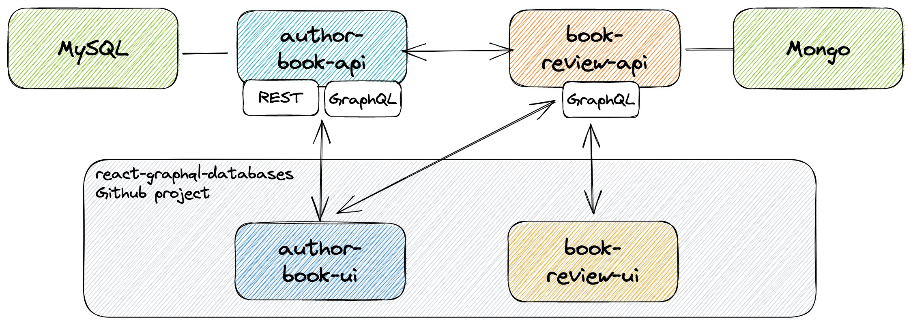

# springboot-graphql-databases

The goal of this project is to explore [`GraphQL`](https://graphql.org). For it, we will implement two [`Spring Boot`](https://docs.spring.io/spring-boot/index.html) Web Java applications: `author-book-api` and `book-review-api`.

> **Note**: In [`kubernetes-minikube-environment`](https://github.com/ivangfr/kubernetes-minikube-environment/tree/master/author-book-review-graphql) repository, it's shown how to deploy this project in `Kubernetes` (`Minikube`).

## Proof-of-Concepts & Articles

On [ivangfr.github.io](https://ivangfr.github.io), I have compiled my Proof-of-Concepts (PoCs) and articles. You can easily search for the technology you are interested in by using the filter. Who knows, perhaps I have already implemented a PoC or written an article on what you are looking for.

## Additional Readings

- \[**Medium**\] [**Implementing and Securing a Spring Boot GraphQL API with Keycloak**](https://medium.com/@ivangfr/implementing-and-securing-a-spring-boot-graphql-api-with-keycloak-c461c86e3972)
- \[**Medium**\] [**Implementing and Securing a Spring Boot GraphQL API with Okta**](https://medium.com/@ivangfr/implementing-and-securing-a-spring-boot-graphql-api-with-okta-78bc997359b4)

## Project Diagram



## Applications

- ### author-book-api

  `Spring Boot` Web Java application that handles `authors` and `books`. It exposes a `GraphQL` endpoint **and** traditional REST API endpoints. `author-book-api` uses [`MySQL`](https://www.mysql.com) as storage and calls `book-review-api` to get the reviews of the books. It uses [`Feign`](https://github.com/OpenFeign/feign) to easily create a client for `book-review-api` and [`Resilience4j`](https://github.com/resilience4j/resilience4j) (fault tolerance library) to handle fallback when `book-review-api` is down. The book `ISBN` is what connects books stored in `author-book-api` with the ones stored in `book-review-api`.

- ### book-review-api

  `Spring Boot` Web Java application that handles `books` and their `reviews`. It only exposes a `GraphQL` API and uses [`MongoDB`](https://www.mongodb.com) as storage.

## Frontend applications

In the repository [`react-graphql-databases`](https://github.com/ivangfr/react-graphql-databases), I have implemented two [`ReactJS`](https://react.dev) applications `author-book-ui` and `book-review-ui` that are frontend applications for `author-book-api` and `book-review-api`, respectively.

If you want to see the complete communication frontend-backend using `GraphQL`, clone the `react-graphql-databases` and follow the README instructions.

## Prerequisites

- [`Java 21`](https://www.oracle.com/java/technologies/downloads/#java21) or higher.
- A containerization tool (e.g., [`Docker`](https://www.docker.com), [`Podman`](https://podman.io), etc.)

## Start Environment

- Open a terminal and inside `springboot-graphql-databases` root folder run:
  ```bash
  docker compose up -d
  ```

- Wait for Docker containers to be up and running. To check, run:
  ```bash
  docker ps -a
  ```
  
## Run applications with Maven

Inside `springboot-graphql-databases`, run the following Maven commands in different terminals:

- **author-book-api**
  ```bash
  ./mvnw clean spring-boot:run --projects author-book-api \
    -Dspring-boot.run.jvmArguments="-Dspring.datasource.username=authorbookuser -Dspring.datasource.password=authorbookpass"
  ```

- **book-review-api**
  ```bash
  ./mvnw clean spring-boot:run --projects book-review-api \
    -Dspring-boot.run.jvmArguments="-Dspring.data.mongodb.username=bookreviewuser -Dspring.data.mongodb.password=bookreviewpass"
  ```
  
## Run Applications as Docker containers

### Build Application's Docker Images

In a terminal and inside `springboot-graphql-databases` root folder, run the following script:
```bash
./build-docker-images.sh
```
      
### Application's environment variables
    
- **author-book-api**

  | Environment Variable   | Description                                                                          |
  |------------------------|--------------------------------------------------------------------------------------|
  | `MYSQL_HOST`           | Specify host of the `MySQL` database to use (default `localhost`)                    |
  | `MYSQL_PORT`           | Specify port of the `MySQL` database to use (default `3306`)                         |
  | `ZIPKIN_HOST`          | Specify host of the `Zipkin` distributed tracing system to use (default `localhost`) |
  | `ZIPKIN_PORT`          | Specify port of the `Zipkin` distributed tracing system to use (default `9411`)      |
  | `BOOK_REVIEW_API_HOST` | Specify host of the `book-review-api` service (default `localhost`)                  |
  | `BOOK_REVIEW_API_PORT` | Specify port of the `book-review-api` service (default `9080`)                       |

- **book-review-api**

  | Environment Variable | Description                                                                          |
  |----------------------|--------------------------------------------------------------------------------------|
  | `MONGODB_HOST`       | Specify host of the `MongoDB` database to use (default `localhost`)                  |
  | `MONGODB_PORT`       | Specify port of the `MongoDB` database to use (default `27017`)                      |
  | `ZIPKIN_HOST`        | Specify host of the `Zipkin` distributed tracing system to use (default `localhost`) |
  | `ZIPKIN_PORT`        | Specify port of the `Zipkin` distributed tracing system to use (default `9411`)      |

### Start Applications as Docker containers

In a terminal and inside `springboot-graphql-databases` root folder, run the following script:
```bash
./start-apps.sh
```

## Application's Link

| Application     | URL Type | URL                                   |
|-----------------|----------|---------------------------------------|
| author-book-api | Swagger  | http://localhost:8080/swagger-ui.html |
| author-book-api | GraphiQL | http://localhost:8080/graphiql        |
| book-review-api | GraphiQL | http://localhost:9080/graphiql        |

## How to use GraphiQL

- **book-review-api**

  1. In a browser, access http://localhost:9080/graphiql

  2. Create a book and return its id:
     ```graphql
     mutation {
       createBook(bookInput: {title: "Getting Started With Roo", isbn: "9781449307905"}) {
        id
       }
     }
     ```

  3. Add one review for the book created above, suppose the id is `5bd4bd4790e9f641b7388f23`:
     ```graphql
     mutation {
       addBookReview(bookId: "5bd4bd4790e9f641b7388f23", reviewInput: {reviewer: "Ivan Franchin", comment: "It is a very good book", rating: 5}) {
         id
       }
     }
     ```

  4. Get all books stored in `book-review-api`, including their reviews:
     ```graphql
     {
       getBooks {
         id
         title
         isbn
         reviews {
           comment
           rating
           reviewer
           createdAt
         }
       }
     }
     ```

- **author-book-api**

  1. In a browser, access http://localhost:8080/graphiql

  2. Create an author and return the author id:
     ```graphql
     mutation {
       createAuthor(authorInput: {name: "Josh Long"}) {
         id
       }
     }
     ```

  3. Create a book and return the book id and author name:
     > **Note**: while creating this book in `author-book-api`, we are setting the same ISBN, `9781449307905`, as we did when creating the book in `book-review-api`.
     ```graphql
     mutation {
       createBook(bookInput: {authorId: 1, isbn: "9781449307905", title: "Getting Started With Roo", year: 2020}) {
         id
         author {
           name
         }
       }
     }
     ```

  4. Get author by id and return some information about his/her books including book reviews from `book-review-api`:
     > **Note**: as the book stored in `author-book-api` and `book-review-api` has the same ISBN, `9781449307905`, it's possible to retrieve the reviews of the book. Otherwise, an empty list will be returned in case `book-review-api` does not have a specific ISBN or the service is down. 
     ```graphql
     {
       getAuthorById(authorId: 1) {
         name
         books {
           isbn
           title
           bookReview {
             reviews {
               reviewer
               rating
               comment
               createdAt
             }
           }
         }
       }
     }
     ```

  5. Update book title and return its id and new title:
     ```graphql
     mutation {
       updateBook(bookId: 1, bookInput: {title: "Getting Started With Roo 2"}) {
         id
         title
       }
     }
     ```

  6. Delete the author and return the author id:
     ```graphql
     mutation {
       deleteAuthor(authorId: 1) {
         id
       }
     }
     ```

## Useful links & commands

- **Zipkin**

  It can be accessed at http://localhost:9411

- **MySQL monitor**
  ```bash
  docker exec -it -e MYSQL_PWD=authorbookpass mysql mysql -uauthorbookuser --database authorbookdb
  SHOW tables;
  SELECT * FROM authors;
  SELECT * FROM books;
  ```
  > Type `exit` to exit the MySQL monitor

- **MongoDB shell**
  ```bash
  docker exec -it mongodb mongosh -u bookreviewuser -p bookreviewpass --authenticationDatabase bookreviewdb
  use bookreviewdb;
  db.books.find().pretty();
  ```
  > Type `exit` to exit the MongoDB shell

## Shutdown

- To stop applications:
  - If they were started with `Maven`, go to the terminals where they are running and press `Ctrl+C`;
  - If they were started as a Docker container, go to a terminal and, inside `springboot-graphql-databases` root folder, run the script below:
    ```bash
    ./stop-apps.sh
    ```
- To stop and remove docker compose containers, network and volumes, go to a terminal and, inside `springboot-graphql-databases` root folder, run the following command:
  ```bash
  docker compose down -v
  ```

## Cleanup

To remove the Docker images created by this project, go to a terminal and, inside `springboot-graphql-databases` root folder, run the following script:
```bash
./remove-docker-images.sh
```

## References

- https://graphql.org/learn
- https://www.pluralsight.com/resources/blog/guides/building-a-graphql-server-with-spring-boot
- https://www.baeldung.com/spring-graphql
