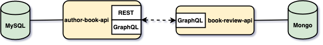

# `springboot-graphql-databases`

The goal of this project is to explore [GraphQL](https://graphql.org). In order to do it, we will implement three
micro-services, discoverable by an `eureka-server`: `author-book-api`, `author-book-client` and `book-review-api`.

# Microservices



## author-book-api

Spring-boot application that handles authors and books. It exposes a GraphQL endpoint **and** traditional REST API endpoints.
`author-book-api` uses [MySQL](https://www.mysql.com) as storage and calls `book-review-api` to get book
reviews. It uses [Feign](https://github.com/OpenFeign/feign) to easily create a client for `book-review-api` and
[Hystrix](https://github.com/Netflix/Hystrix) (latency and fault tolerance library) to handle situations when
`book-review-api` is down. The book `ISBN` is what connects books stored in `author-book-api` with the ones stored in
`book-review-api`.

## book-review-api

Spring-boot application that handles books and their reviews. It only exposes a GraphQL API and uses
[MongoDB](https://www.mongodb.com) as storage.

## author-book-client

Spring-boot application that consumes `author-book-api` and display the information in an user friendly interface
implemented using [Thymeleaf](https://www.thymeleaf.org). It is not implemented yet.

# Start Environment

## Docker Compose

- Open one terminal

- In `/springboot-graphql-databases` root folder run
```
docker-compose up -d
```
> To stop and remove containers, networks and volumes
>```
>docker-compose down -v
>```

- Wait a little bit until all containers are Up (healthy). You can check their status running
```
docker-compose ps
```

# Start Services

## eureka-server

- Open a new terminal

- Inside `/springboot-graphql-databases` root folder run
```
./mvnw spring-boot:run --projects eureka-server
```

- The link for `eureka-server` is http://localhost:8761

## author-book-api

- Open a new terminal

- Inside `/springboot-graphql-databases` root folder run
```
./mvnw spring-boot:run --projects author-book-api
```

- The link for `author-book-api` **Swagger** web page is: http://localhost:8080/swagger-ui.html

- The link for `author-book-api` **GraphiQL** web page is: http://localhost:8080/graphiql

## book-review-api

- Open a new terminal

- Inside `/springboot-graphql-databases` root folder run
```
./mvnw spring-boot:run --projects book-review-api
```

- The link for `book-review-api` **GraphiQL** web page is: http://localhost:8081/graphiql

## author-book-client

- Open a new terminal

- Inside `/springboot-graphql-databases` root folder run
```
./mvnw spring-boot:run --projects author-book-client
```

- The link for `author-book-client` web page is http://localhost:8082

# How to use GraphiQL

## book-review-api

- access http://localhost:8081/graphiql

- create book and return its id
```
mutation {
  createBook(bookInput: {title: "Introdution to GraphQL", isbn: "123"}) {
    id
  }
}
```

- add one review for the book created above, suppose the id is `5bd4bd4790e9f641b7388f23`
```
mutation {
  addBookReview(bookId: "5bd4bd4790e9f641b7388f23", reviewInput: {reviewer: "Ivan Franchin", comment: "It is a very good book", rating: 8}) {
    id
  }
}
```

- get all books stored in book-review-api, including their reviews
```
{
  getAllBooks {
    id
    title
    isbn
    reviews {
      comment
      rating
      reviewer
    }
  }
}
```

## author-book-api

- access http://localhost:8080/graphiql

- create author and return its id
```
mutation {
  createAuthor(authorInput: {firstName: "Ivan", lastName: "Franchin"}) {
    id
  }
}
```

- create book and return the book id and author's first and last name
```
mutation {
  createBook(bookInput: {authorId: 1, isbn: "123", title: "Introdution to GraphQL", year: 2018, numPages: 512}) {
    id
    author {
      firstName
      lastName
    }
  }
}
```

- get author by id and return some information about his/her books including reviews of the book stored in `book-review-api`.

> **Note**: as the book stored in `author-book-api` and `book-review-api` has the same ISBN, `123`, it's possible to
retrieve the reviews of the book. Otherwise, an empty list will be returned in case `book-review-api` does not have a
specific ISBN or the service is down. 
```
{
  getAuthorById(authorId: 1) {
    firstName
    lastName
    books {
      isbn
      title
      reviews {
        rating
        comment
      }
    }
  }
}
```

- update book title and return its id and new title
```
mutation {
  updateBook(bookId: 1, bookInput: {title: "GraphQL in a Nutshel"}) {
    id
    title
  }
}
```

- delete author and return his/her id
```
mutation {
  deleteAuthor(authorId: 1) {
    id
  }
}
```

# Useful links & commands

### Hystrix Dashboard

- It can be accessed at http://localhost:8080/hystrix

- Add `http://localhost:8080/actuator/hystrix.stream` to the input field.

### MySQL
```
docker exec -it author-book-mysql bash -c 'mysql -uroot -psecret --database=authorbookdb'
show tables;
select * from authors;
select * from books;
```

### MongoDB
```
docker exec -it book-review-mongodb mongo
use bookreviewdb;
db.books.find().pretty();
```

# TODO

- replace `Hystrix` by `Resilience4j`;

- implement `author-book-client`;

- study how to implement authentication/authorization to `GraphQL` endpoint;

- implement `graphql` subscription;

# References

- https://graphql.org/learn

- https://www.pluralsight.com/guides/building-a-graphql-server-with-spring-boot

- https://www.baeldung.com/spring-graphql